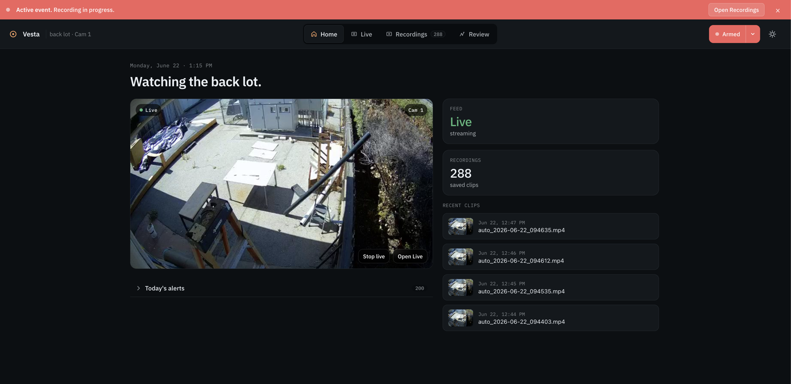
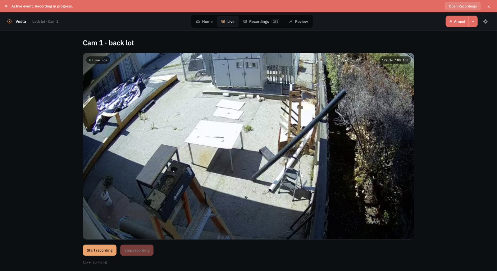
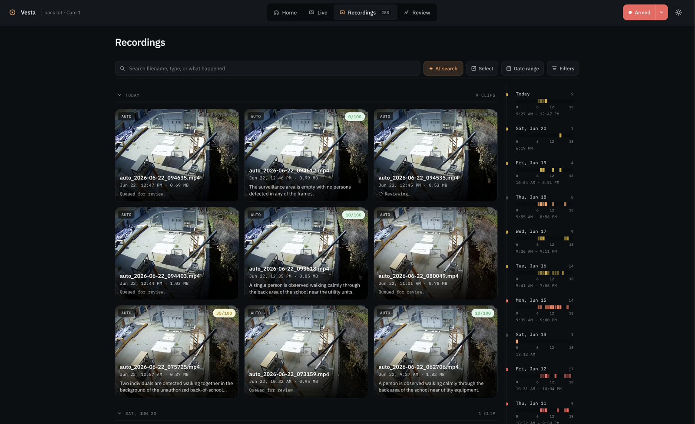
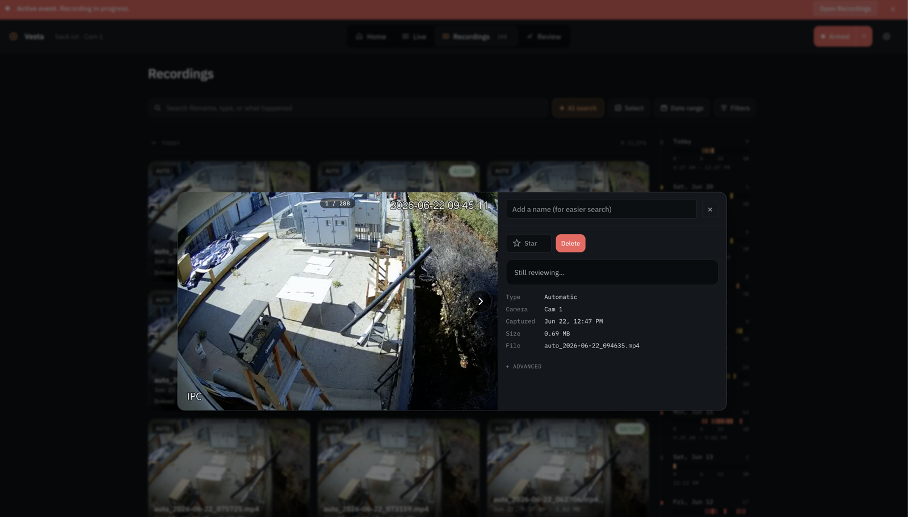

# Vesta

<div align="center">

[](https://www.python.org/)
[](https://flask.palletsprojects.com/)
[-00AEEF?style=flat-square)](https://github.com/ultralytics/ultralytics)
[](https://github.com/ggml-org/llama.cpp)
[](#why-vesta)
[](#status)



**Self-hosted, privacy-first surveillance assistant for schools.** On-device YOLO person
detection paired with a local vision-LLM that describes what is actually happening on
camera, without ever sending video, frames, or captions to a third-party cloud.

</div>

Vesta was developed for **Stratford Schools / Spring Education Group** as a tool to help
staff investigate and counter on-campus theft. Footage and analysis stay on hardware the
school controls. It ingests a live RTSP camera, records on motion, captions every clip with
a local vision model, scores clips for threat, and lets staff search the library by what
happened rather than by filename.

## Contents

- [Why Vesta](#why-vesta)
- [What it does](#what-it-does)
- [Screenshots](#screenshots)
- [Architecture](#architecture)
- [Getting started](#getting-started)
  - [1. Bring up the local LLM server](#1-bring-up-the-local-llm-server)
  - [2. Start Vesta](#2-start-vesta)
- [Configuration](#configuration)
- [Repository layout](#repository-layout)
- [Status](#status)
- [License & use](#license--use)

## Why Vesta

Most "AI camera" products ship footage to a vendor's cloud for analysis. For a school that
is unacceptable:

- Student and staff video is sensitive data.
- Network egress of raw footage is expensive and slow.
- Vendor lock-in makes evidence harder to retrieve when something goes wrong.

Vesta is built around the opposite trade-off:

- **Local-first.** Detection, captioning, and summarization all run on a machine you own.
- **Localhost-able.** The entire stack runs on a single workstation behind the school
  firewall and is reached at `http://127.0.0.1:33263`.
- **Auditable.** Inputs, outputs, and cached artifacts live on disk in plain files you can
  inspect, archive, or delete.
- **Built for an actual problem.** Designed around the loss-prevention workflow of Stratford
  Schools: watch a hallway or stockroom camera, get the time ranges that contain people plus
  a short written description of what each person is doing.

## What it does

Vesta runs as a single Flask web app with four cooperating capabilities:

- **Live view.** Connects to an RTSP camera with automatic reconnect and path discovery,
  and streams the feed in the browser with one-click start/stop recording.
- **Autonomous watch.** A YOLO person-dwell trigger arms the camera, auto-records when
  someone is present, and hands each clip to the local vision-LLM for post-analysis. An
  **Arm** toggle drives a site-wide lockdown visual state and turns autonomous capture on.
- **Recordings library.** Every clip is date-stamped, thumbnailed from its first frame,
  auto-captioned by the local vision model, and given a **threat score**. Clips can be
  starred, renamed, flagged, deleted, and re-analyzed. Free-text **AI search** finds clips
  by *what happened* ("two people walking past utility cabinets") instead of by filename.
- **On-demand analysis.** Upload a single video and Vesta detects people frame-by-frame
  with YOLO, extracts annotated per-person clips, builds temporal mosaics (grids of
  person-only frames so a vision model can reason over motion in one image), captions each
  mosaic, and returns a whole-video summary plus a threat assessment.

All captioning and summarization run against a local llama.cpp server speaking the OpenAI
`chat/completions` protocol. No outbound network calls are required at inference time.

## Screenshots

**Watch dashboard.** The day-to-day landing page. Active-event banner up top, the camera
you're watching front-and-center, and the most recent auto-saved clips on the right.


**Live view.** A single camera feed with one-click start/stop recording. Useful when staff
want to keep an eye on a specific area in real time.



**Recordings library with AI search.** Every clip is auto-captioned by the local vision-LLM,
so you can search by what happened instead of by filename or timestamp. The right rail is a
calendar/timeline of clip density.



**Clip detail.** Metadata pane for a single recording: camera, timestamp, duration, file
size, threat score, plus star/rename for easier recall later.



## Architecture

```
   RTSP camera ──► Live ingest ──► Browser (Flask web UI)
                        │
                        ├──► YOLO  (person detection, dwell trigger, GPU/CPU)
                        │        │
                        │        └──► Autonomous watch: auto-record on dwell
                        │
                        ├──► llama.cpp server  (vision-LLM captions, summaries, threat score)
                        │
                        └──► runtime/  (uploads, recordings + sidecar meta, mosaics, cache)
```

Two processes on one host: the Vesta web app (YOLO + glue) and a local llama.cpp server
(vision captioning + summarization). No outbound network calls are required at inference
time.

## Getting started

Vesta has two components that need to be running side by side:

1. **The local LLM backend** ([llama.cpp](https://github.com/ggml-org/llama.cpp)) that does
   the vision captioning and summarization.
2. **The Vesta web app**, which does YOLO person detection and talks to the LLM over HTTP.

### 1. Bring up the local LLM server

Build llama.cpp (see [their build docs](https://github.com/ggml-org/llama.cpp/blob/master/docs/build.md))
and download a vision-capable GGUF plus its matching `mmproj` projector file. Known-good
models: **Qwen2-VL 7B Instruct** or **LLaVA 1.6 Mistral 7B**.

Start the server on port `8078` (the default Vesta expects):

```bash
./build/bin/llama-server \
  --host 127.0.0.1 --port 8078 \
  -m   ~/models/Qwen2-VL-7B-Instruct-Q4_K_M.gguf \
  --mmproj ~/models/mmproj-Qwen2-VL-7B-Instruct-f16.gguf \
  -c 8192 \
  --n-gpu-layers 99   # drop this flag for CPU-only
```

Sanity check: `curl http://127.0.0.1:8078/v1/models` should return JSON.

### 2. Start Vesta

```bash
uv sync
./run.sh
# open http://127.0.0.1:33263
```

Full step-by-step (system packages, YOLO weights, systemd units, troubleshooting): see
[**INSTALL.md**](INSTALL.md).

## Configuration

Vesta reads its defaults from environment variables, so nothing in the code needs editing to
point it at your own camera or LLM:

| Variable | Default | Purpose |
|---|---|---|
| `LLAMACPP_BASE_URL` | `http://127.0.0.1:8078` | Local vision-LLM endpoint (OpenAI-compatible). |
| `LLAMACPP_MODEL` | `local-model` | Model name sent with each request. |
| `LIVE_RTSP_URL` | (sample camera) | RTSP URL for the live/autonomous feed. |
| `AUTONOMOUS_TRIGGER_HITS` | `3` | Consecutive person detections before auto-recording starts. |
| `AUTONOMOUS_MAX_CLIP_S` | `180` | Maximum length of an auto-recorded clip. |
| `AUTONOMOUS_PROMPT` | (threat prompt) | Instruction the vision-LLM uses to analyze auto-clips. |

## Repository layout

| Path | Contents |
|---|---|
| `main.py` | Unified Flask app: live RTSP ingest, autonomous watch, recordings library, job runner, YOLO + LLM glue. |
| `templates/index.html` | Single-page web UI. |
| `run.sh` | Launch the web app on port `33263`. |
| `test_recorded_pipeline.py` | End-to-end test of the recorded-clip analysis pipeline. |
| `person-detect/` | YOLO assets (`yolo26s.onnx`, optional `yolo26s.pt`) and the standalone detection demo. |
| `video-understanding/` | Earlier mosaic-captioning experiments. |
| `runtime/` | Created on first run; holds `uploads/`, recordings + sidecar metadata, `outputs/`, and `cache/`. |
| [`INSTALL.md`](INSTALL.md) | Full install and startup guide. |

## Status

`v0.1.0` is the first usable release: single-user web UI, live RTSP view, autonomous watch,
a searchable recordings library, and async on-demand analysis, with a documented install
path. Live RTSP and UI polish that have not landed on `main` are tracked on the
`feature-rtsp-stream` and `ui-polish` branches.

## License & use

Vesta is an internal tool developed for Stratford Schools / Spring Education Group. Use
outside that context is at your own discretion; review the code before deploying it anywhere
that handles minors' video.

---

Maintained by [@xerneas3318](https://github.com/xerneas3318).
</content>
</invoke>
